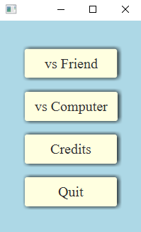
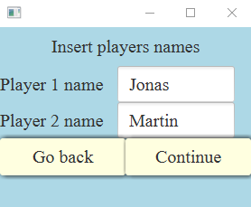
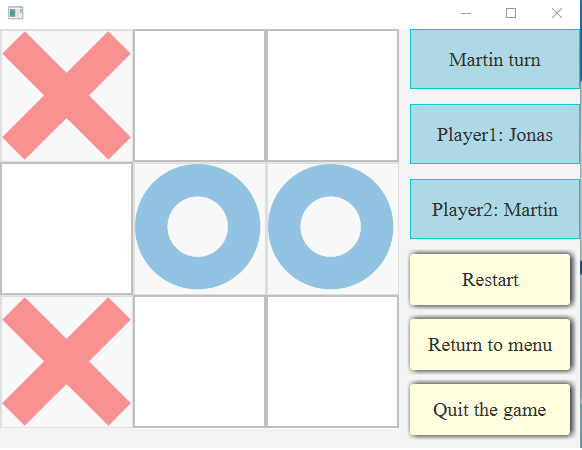

# Tic-Tac-Toe desktop game

A classic desktop game of Tic-tac-toe where two players are taking turns in setting X's and 0's on the board.  

## Technologies

+ Java programming language

## Getting Started

In order to run the project a small amount of prerequisites and additional steps have to be fulfilled.

### Prerequisites

+ IntelliJ IDE (or any other)

### Running

+ Run Start.java file
+ Choose "vs Friend" game mode
+ Insert credentials of the players
+ Start the game

